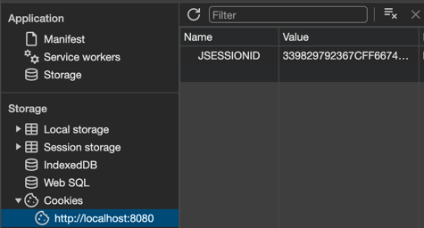
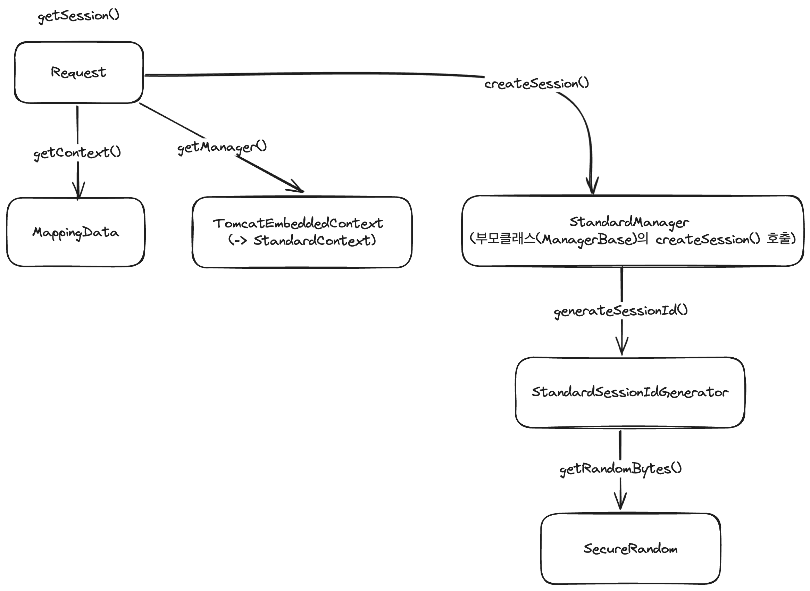
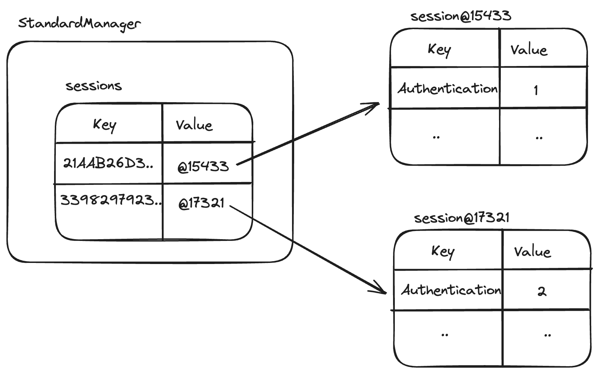
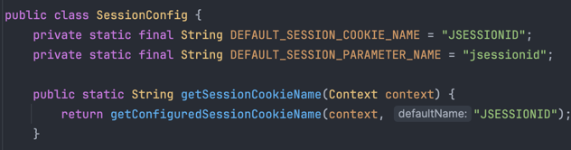

## 들어가며

토이 프로젝트의 유저 인증방식을 세션으로 선택한 후 내부동작을 탐색하며 작성하는 포스팅입니다.

### 세션 관리의 내부동작을 왜 찾아봤을까?

오해는 여기에서 시작되었습니다. 아래와 같은 코드를 작성 후 브라우저를 확인해보았습니다.

```java
public ResponseEntity<Void> demo(HttpServletRequest request) {
  HttpSession session = request.getSession();
  session.setAttribute("JSESSIONID", 1234);
  return ResponseEntity.ok().build();
}
```



스프링에서 제공하는 `HttpServletRequest` 객체에 세션을 설정만 하면 브라우저에서 사진과 같이 쿠키가 설정되어 있는 모습을 확인할 수 있습니다.

당연히 Name, Value가 세션의 각각 Key, Value라고 생각하고(사실이 아니었지만) 1234라는 숫자가 어떻게 339829792367CFF6674AE630DC79A78C로 암호화되는 걸까 라는 생각으로
내부 구현을 확인하게 되었습니다.

## getSession()에서 일어나는 일 (쿠키에 세션데이터가 없을 때)



`HttpServletRequest.getSession()` 메서드를 호출하면 Http 요청에 세션이 없다면 새롭게 생성해줍니다. `HttpServletRequest`의 구현체인 `Request`가 구현한 `getSession()`을 호출합니다.

1. `Request`가 `MappingData`에게 `Context`를 요청합니다.
2. `Request`가 `Context`에게 `Manager`를 요청합니다.
3. `Request`가 `Manager`에게 `Session`을 요청합니다.
4. `Session`은 `SecureRandom`에게 랜덤바이트코드를 요청합니다.
5. `SecureRandom`은 SHA1PRNG 알고리즘을 통해 랜덤한 문자열을 생성 후 반환합니다.

**그렇습니다. 브라우저의 Value에 나타난 값은 1234를 암호화한 값이 아니라 스프링에서 생성한 랜덤한 sessionId입니다.**

이후 `setAttribute("foo",1234)`를 호출하면 `Session`이 key, value 데이터(attribute)를 저장합니다. (e.g. "foo", 1234)

## 스프링의 Session 관리 데이터 구조



상위 그림에서 보여지는 `StandardManger`가 Tomcat이 동작한 이후에 생성된 Session 목록을 관리합니다. 새롭게 생성된 `session`은 `sessions`에 추가됩니다.
key는 sessionId(위에서 생성한 랜덤문자열)이며 value는 Map 형태로 지니고 있습니다. 여러 유저들이 서버에 접근하거나, 브라우저에서 쿠키를 지우고 세션을 생성하면 `sessions`에 계속해서 `session`이 생성됩니다.


## getSession()에서 일어나는 일 (쿠키에 세션데이터가 있을 때)

스프링컨테이너는 HTTP요청이 들어오면 HttpMessage에서 쿠키에 존재하는 sessionId를 읽어들입니다. 이후 `StandardManager`가 소유한 `sessions`에서 해당하는 key값을 통해 session을 반환합니다.


## 브라우저에 노출되는 쿠키

스프링 컨테이너는 세션을 쿠키에 작성해 내려줄 때 기본값으로 JSESSIONID 문자열을 이용합니다. 당연하게도 `setAttribute()`에서 지정해주는 key값과는 관계가 없습니다.



## 마치며

스프링에서 session을 어떻게 생성하고 관리하는지 알게 되었습니다.

다들 session에 대해 저처럼 헷갈리지 않으셨으면 좋겠습니다.

